Title: Build AWS CodePipeline CI/CD for your Django Application
Date: 2019-2-15 22:50
Modified: 2019-2-15 22:50
Category: tutorial
Cover: images/codepipeline/cover.png
Tags: devops, cicd, aws, aws codepipeline, codecommit, django, continuous integration, continuous deployment
Slug: build-aws-codepipeline-for-cicd
Summary: In this article, you'll learn how to setup AWS CodePipeline for Continuous Integration and Continuous Delivery (CI/CD) pipeline for your Django Application.

> Assumption: For this tutorial, I am assuming you already have an EC2 instance where you've configured and deploy a Django application. 

In [previous tutorial](https://girisagar46.github.io/from-bitbucket-pipeline-to-aws-codecommit), you learnt about syncing your BitBucket repository to AWS CodeCommit. Now, since your source code is already into AWS CodeCommit, you can now setup AWS CodePipeline for CI/CD. 

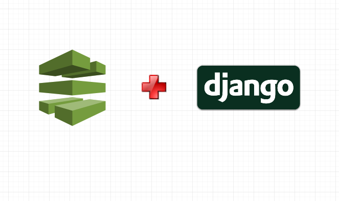

This tutorial will be a little bit long and I will guide you to setup AWS CodePipeline for your Django application step by step with no step skipped. 

Okay, Let's begin!

## Step 0 (True programmer starts counting from zero ;) )

- Go to AWS Console and select AWS CodePipeline which is under the **Developer Tools** section. Or you can also search for AWS CodePipeline by typing the name under **Find Services**

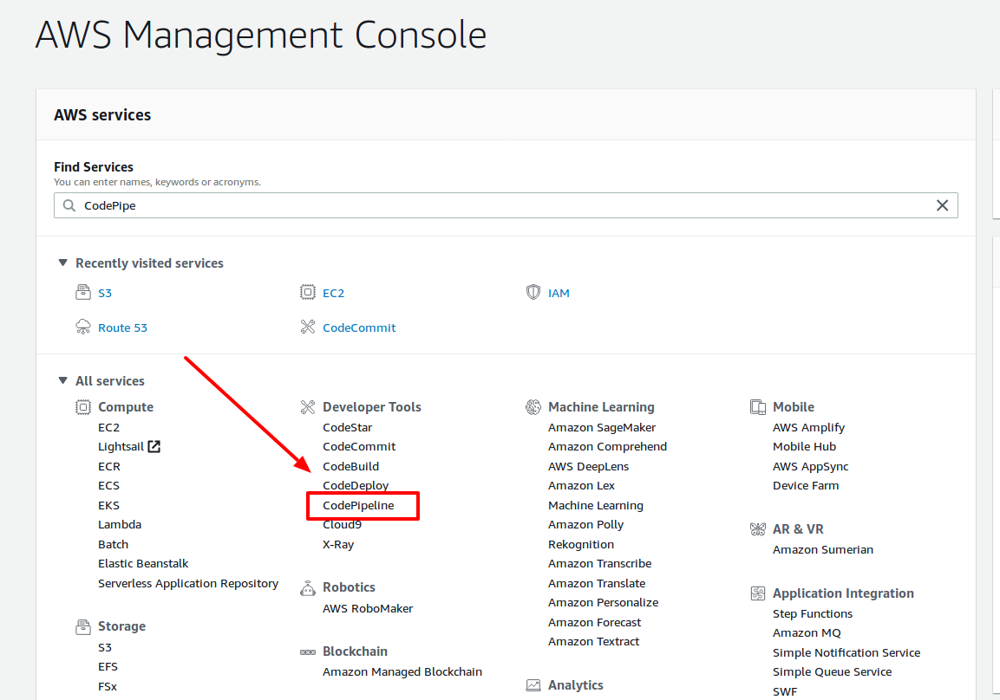

*AWS Console*

## Step 1

- Once you are in AWS CodePipeline click on **Create pipeline** button. You'll be then redirected to **Choose pipeline settings**

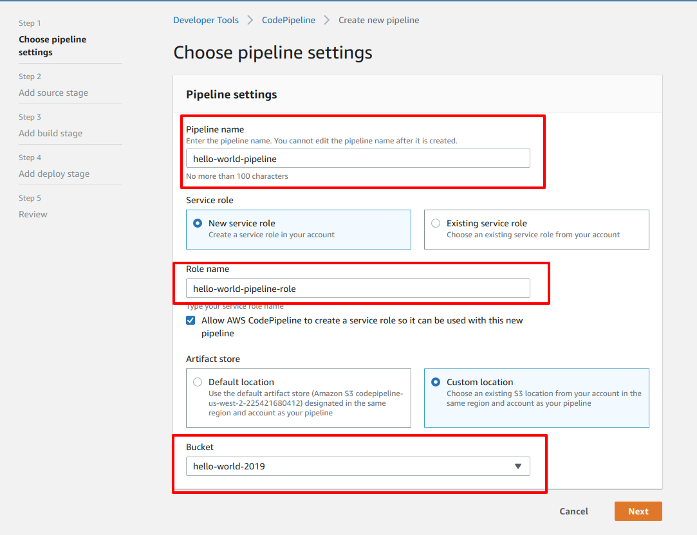 

- Give yor pipeline a name under the **Pipeline name** input field.
- Select **New service role** under the **Service role** section.
- Under **Role name** section, you'll be provided a default role name. But, you may wish to give a proper name which you can remember. In that case, provide your own **Role name**. 
- Check the checkbox that says *Allow AWS CodePipeline to create a service role so it can be used with this new pipeline*
- Under **Artifact store**, select **Custom location**. And here's a tricky part. Artifacts are files that is generated after the CI part is completed. These artifacts need to be stored somewhere. In CodePipeline's case, it's the S3 bucket. If you choose **Default location**, your artifacts will be stored in the S3 location defined by the CodePipeline itself. In my case, I choose to store my artifacts in my own S3 bucket. Here's a [tutorial](#) if you don't know how to create a S3 bucket. 
- After filling up this form, click the **Next** button.

## Step 2

- After clicking **Next** at the end of **Step 1**, you'll see another form where you'll **Add source**

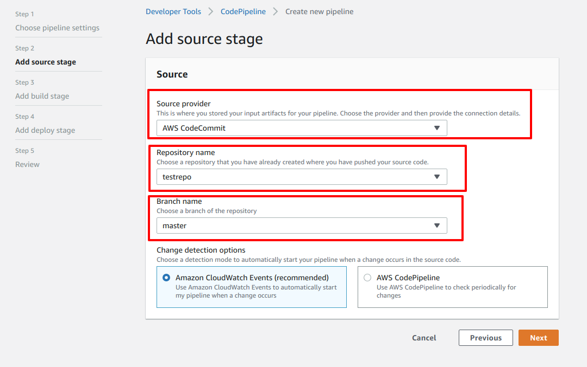

- Select **Source provider**. In this case, I am selecting **AWS CodeCommit** because I've already [synced my BitBucket repository to AWS CodeCommit](https://girisagar46.github.io/from-bitbucket-pipeline-to-aws-codecommit). 
- Select your **Repository name** from the drop down option.
- Select the **Branch name** from the dropdown option. This **Branch name** indicates triggering of CI when a commit is made to this branch.
- On **Change detection options** select the recommended option **Amazon CloudWatch Events**
- Click **Next** and start **Step 3**

## Step 3

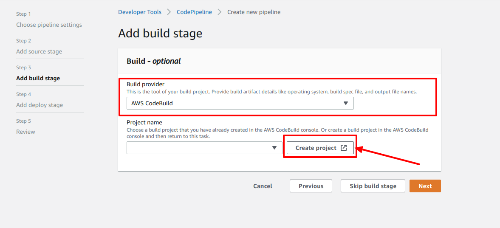

- Select **Build provider** as **AWS CodeBuild**
- Now, you need to setup a **Project** for AWS CodeBuild. Click on **Create project** button as shown in the picture. 
- When you click that **Create project**, a new window will open where you will setup a CodeBuild project. Let's call it **Step 4** for now. Now, let's jump to **Step 4**

## Step 4

I'll be breaking down this step into small chunks. 

### Step 4-1 (Create build project)
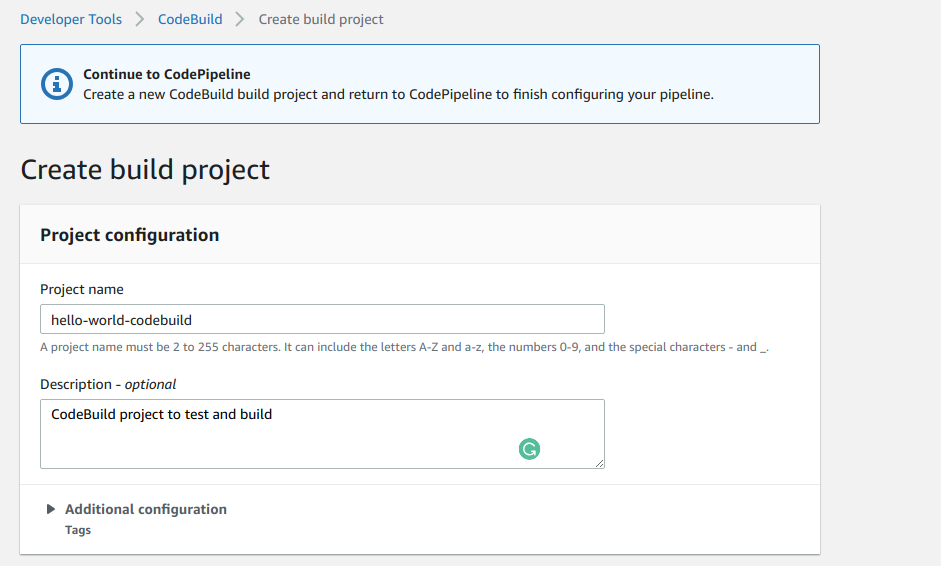

- Give your project a name under **Project name** input field.
- Give a project **Description** if you like. It's totally optional but it's a good practice to describe what it does. 
- You can add tags to your project but, I am leaving it blank for now.

### Step 4-2 (Environment)

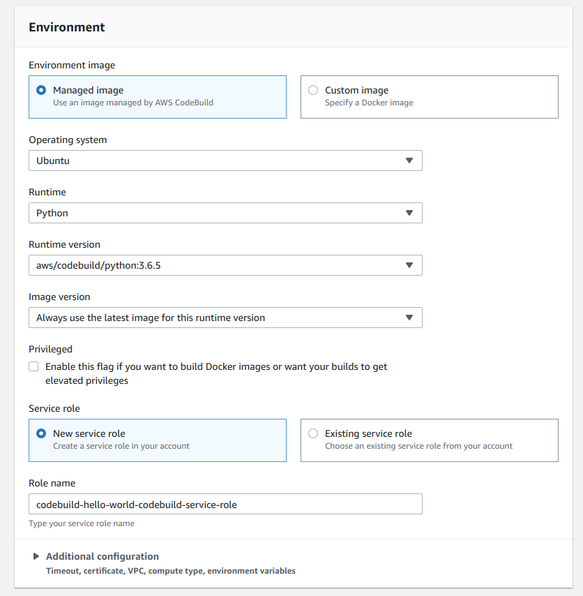

- Just below **Create build project**, you'll see **Environment** configuration
- Select **Managed image** under **Environment image** section
- Select **Operating system** as **Ubuntu**
- Runtime **Python** (Remember, we are doing CI for Django application)
- **aws/codebuild/python:3.6.5** as **Runtime version**
- Select **Always use the latest image for this runtime version** under the **Image version** section
- I am not selecting **Privileged** option. It's description is self explanatory. If you want more details, see the AWS CodeBuild official documentation
- Choose **New service role** under the **Service role** section. We are selecting **New service role** because we haven't created any role yet for the code build from IAM. So, we'll just create a new one.
- Give a proper **Role name** so that you can remember and if you see it in the IAM console, you'll just instantly recognize that this is a role or AWS CodeBuild
- I am leaving **Additional configuration** as empty. This is where you set up Environment variables, system configuration and so on. You can setup some **Additional configuration** if you like

### Step 4-3 (Buildspec)

- Select **Use a buildspec file** under **Build specifications**
- Under the **Buildspec name** section, you can add your own custom name if you have custom buildspec yml file but that's completely optional
- Fill out the **Logs** section. Your build logs are all streamed to **AWS CloudWatch** if you want. You can also use S3 to store your logs. In my case, I chose **AWS CloudWatch** and gave a **Group name** and **Stream name**
- Now click on **Continue to CodePipeline** button and you will be redirected to that page (**Step 3**)

## Step 5

- After **Step 4-3**, you'll be redirected to that **Add build stage** page and you'll see your newly created build project. If you don't see it there, then just refresh the page.

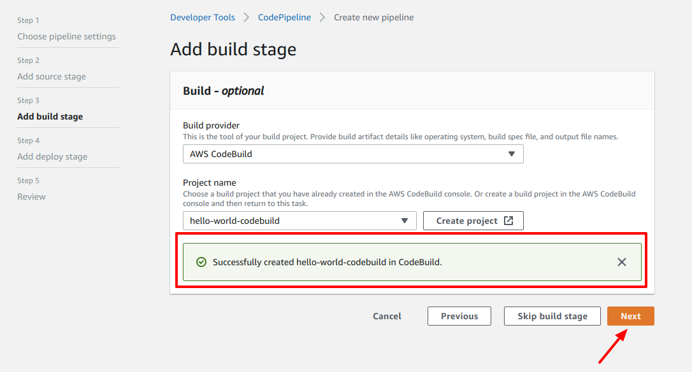

- Now, click the **Next** button.

## Step 6

- This step is called **Add deploy stage**
- First, choose the deploy provider. Select **AWS CodeDeploy**
- Under the **Application name** section, you should choose the CodeDeploy application. Since, we haven't yet created the CodeDeploy application, let's just create one. Don't close this browser tab. Just open new browser tab and go to **Step 7**

## Step 7

- To create the **AWS CodeDeploy** application, first go to the **CodeDeploy** section from AWS Console and click on the **Create application** button. You'll then see **Application configuration** form. Give your application a name **Application name** and choose the **Compute platform** as **EC2/On-premises** since we are deploying our application on our EC2 server.

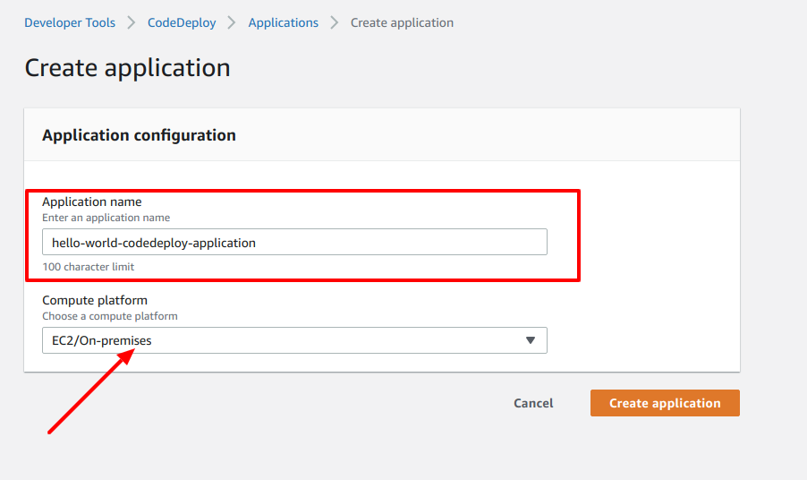

- After you create the CodeDeploy application, we need to divert a little bit to setup a **New service IAM Role** and a **Deployment group**. We'll continue from **Step 6** after setting up the deployment group. For now, let's go to step 8. We'll revisit **Step 6** after this.

## Step 8 (Create New service IAM Role for CodeDeploy)

- Go to the **AWS IAM Console**
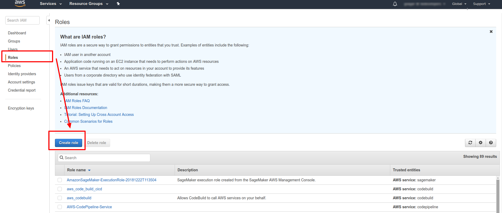
- Click on **Roles** on the sidebar menu
- Then click on **Create role** button.

- Select **CodeDeploy** and also **CodeDeploy** under **Select your use case**
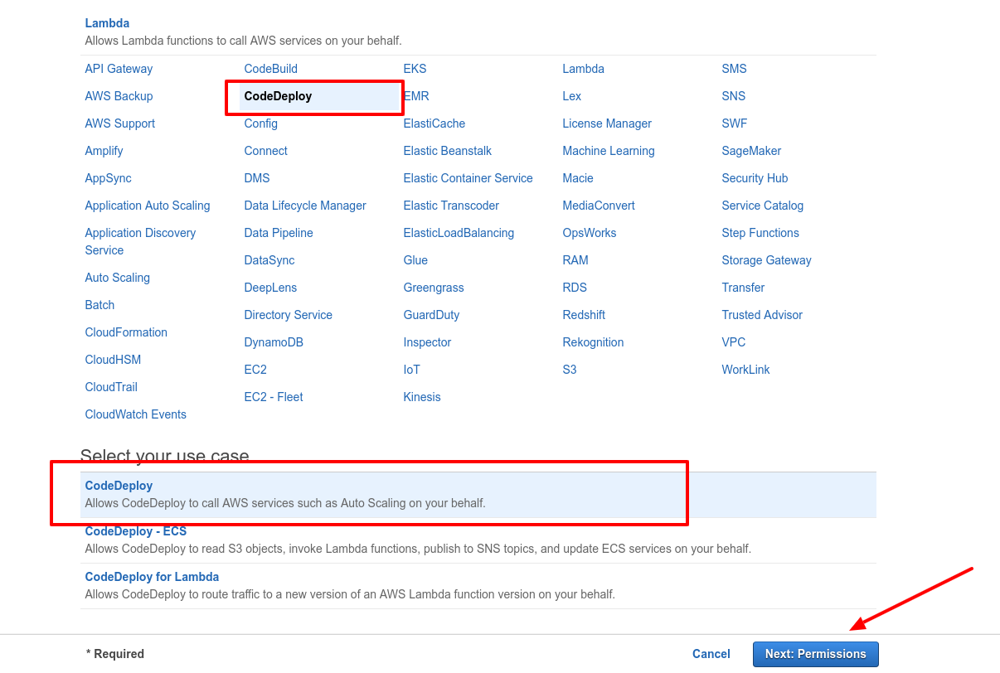
- You'll see something like this:

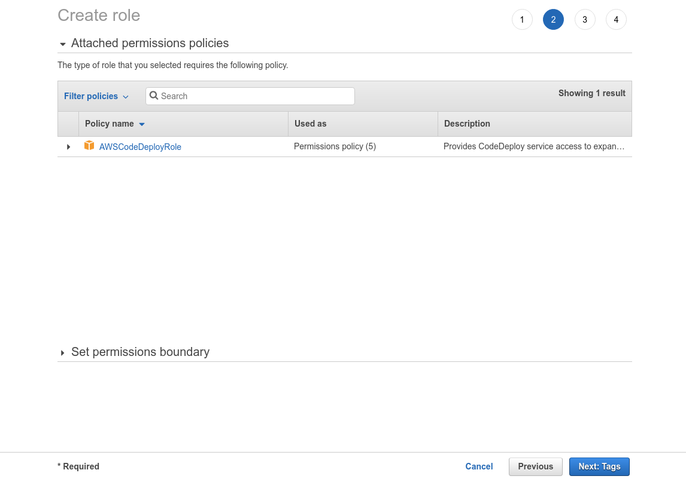

- Click **Next: Tags**
- Give your role a tag with **Name** and **Value** if you like
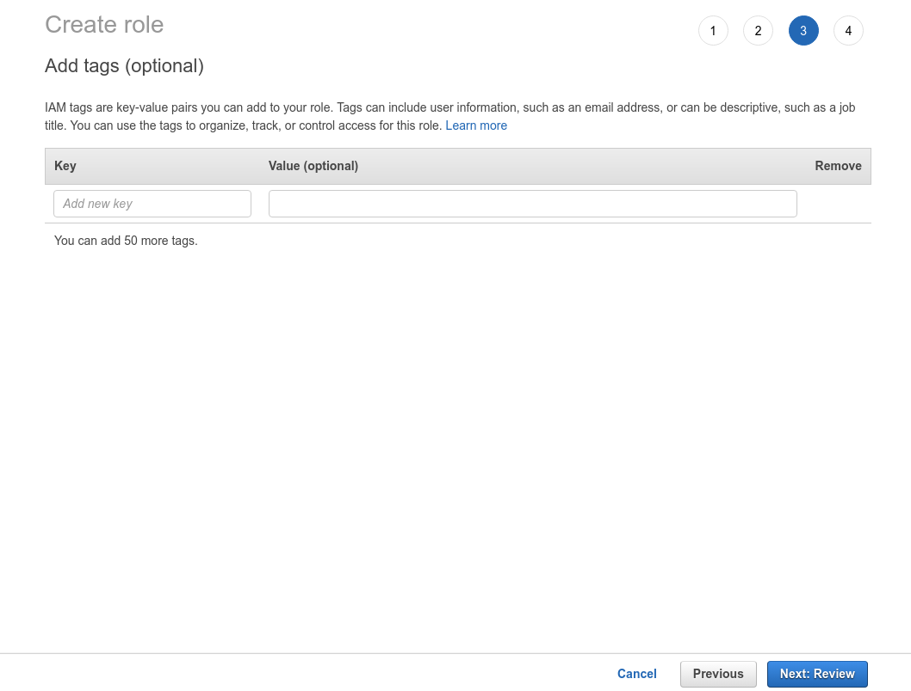

- Click **Next: Review** button

- Give your role a name. We'll be using this role while creating deployment group.
- Then click on **Create role** button

## Step 9 (Create deployment group)

- Under **CodeDeploy** > **Application** section, you'll see the **CodeDeploy** application name *hello-world-codedeploy-application* that you just created in **Step 7**
- Click on the application link and under the **Deployment groups** tab, you'll see a button that says **Create deployment group**. Click that.
- You'll see a form like this:

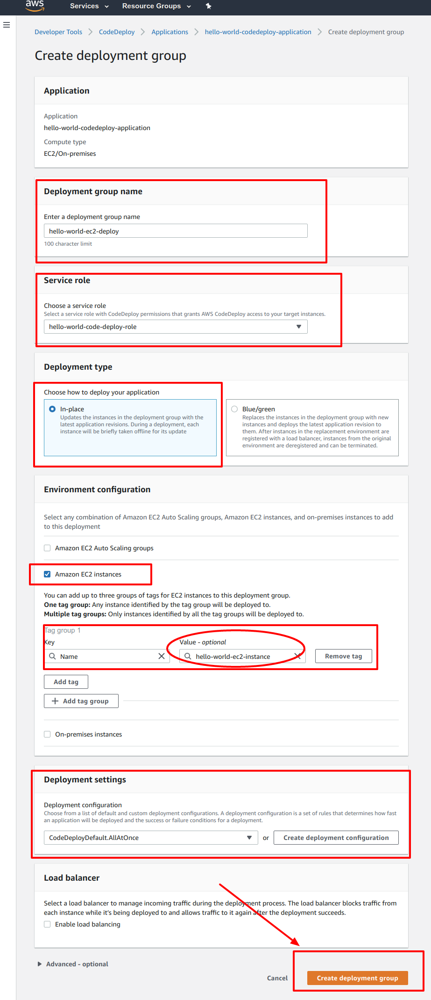

- Under the **Service role** section, select the service role that you just created on **Step 9**

- Under **Environment configuration** section, select **Amazon EC2 instances**. Then add tags. These tags are actually the EC2 instance tag that you've already setup for Django application deployment

- Fill out the form and click **Create deployment group** button
- Your deployment group will be created and you'll see a page just like this:

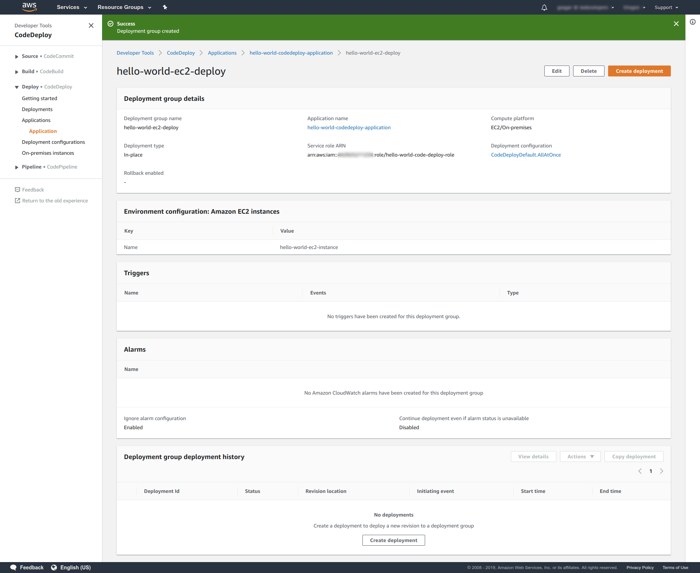

## Step 10

- Now go to **Step 6** where you've left off. Since, we've just created **CodeDeploy application** and **Deployment group**. Select those values in specific fields. If they are not populated under the select dropdown, just refresh the page and you'll be fine.
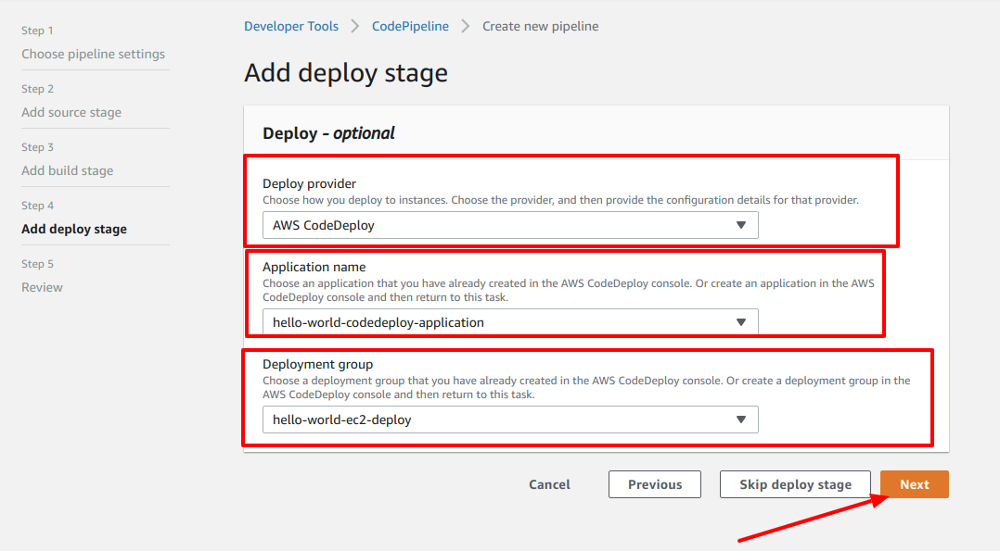
- Click **Next** button and go to **Step 11**

## Step 11

- This is probably the last step of our code pipeline setup. After clicking the **Next** button from **Step 10**, you'll see a **CodePipeline Review** page. 

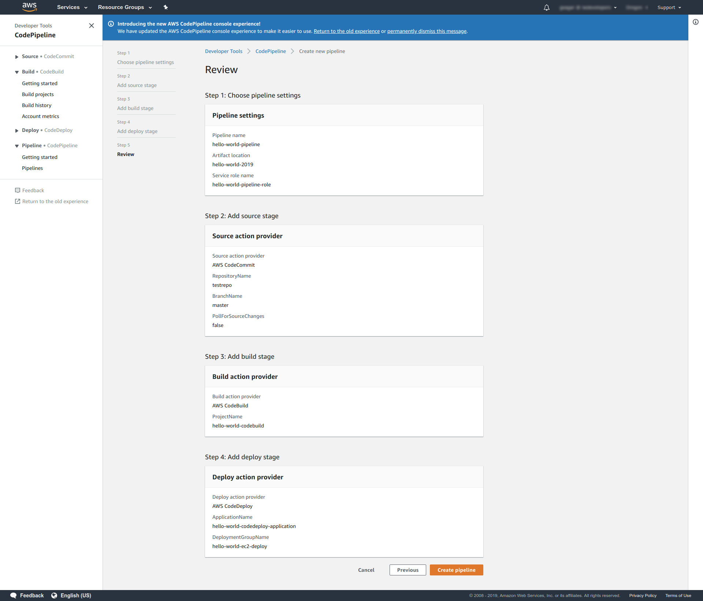

- Just go through it and check if everything is setup correctly
- If you need to change something, go to previous section. And if you think everything is fine, click on **Create pipeline** button

## Step 12

- You'll see a success page something like this.

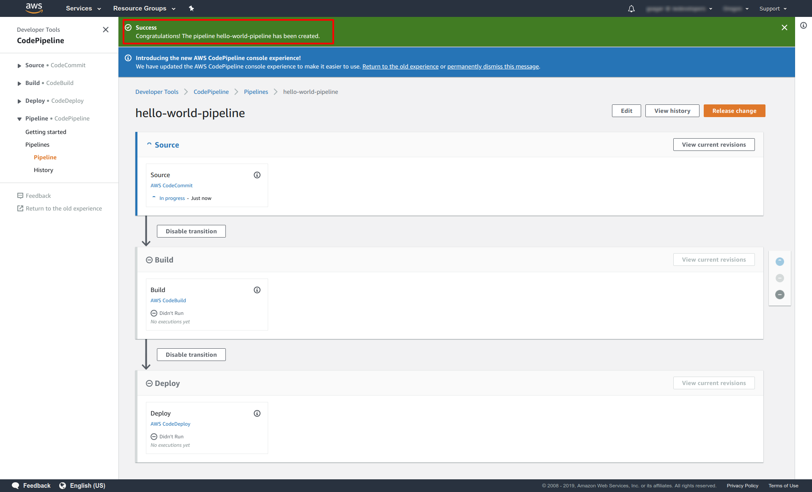

## Step 13 (Create buildspec.yml file)

At this point, your pipeline will obviously fail in the **Build** section because we haven't setup the `buildspec.yml` file.

Here's a `buildspec.yml` file that I setup for my django project pipeline. Take a reference and change accordingly.

**I'll be writing a separate post on what's going inside the `buildspec.yml` file. But, for now just copy-paste this in your `buildspec.yml` file and push it to your repository.

## Step 14 (Create appspec.yml file)

Your CodePipeline will still fail on **Deploy** part because we haven't still setup an `appspec.yml` file yet. This file is used by the CodeDeploy to deploy our application to the EC2 instance.

Here's the configuration for my `appspec.yml` file that I setup for my django project pipeline. Take a reference and change it accordingly.

**After this, your CodePipeline should be Green.**
