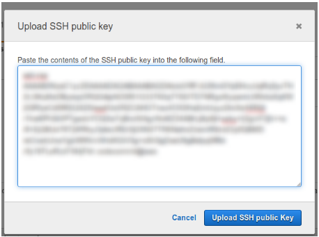
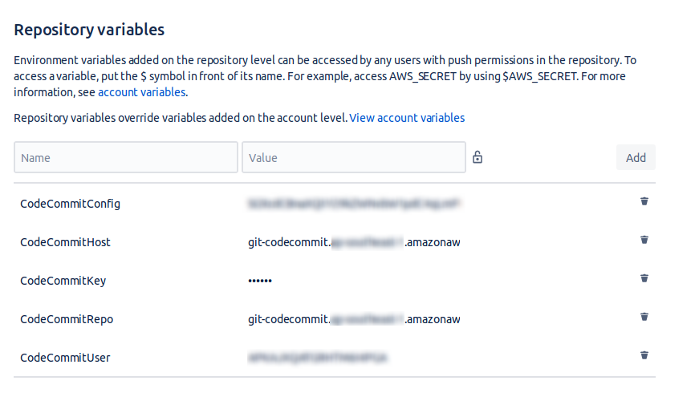

Title: From Bitbucket Pipeline to AWS CodeCommit
Date: 2019-2-8 22:8
Modified: 2019-2-8 22:8
Category: tutorial
Tags: devops, cicd, aws, aws codepipeline, codecommit
Slug: from-bitbucket-pipeline-to-aws-codecommit
Summary: In this article you'll ne learning how to sync your BitBucket repository to AWS CodeCommit. Once your AWS CodeCommit is synced with your BitBucket repo you can use AWS CodeCommit for many AWS services like CodePipeline, CodeBuild, CodeDeploy etc.


## Setup codecommit IAM user

- Create new user from AWS IAM console

- Give two permission to that new codecommit user: 
    - `AWSCodeCommitFullAccess` and 
    - `AmazonS3FullAccess`

- Open that new user from IAM console. Under user's section and go to **Security Credentials** tab

- Under **SSH keys for AWS CodeCommit** upload new SSH public key. 

- To do this open up your terminal and add following commands:
    - `$ ssh-keygen -f ~/.ssh/codecommit_rsa`
    - And inside **.ssh** folder you’ll find `codecommit_rsa` and `codecommit_rsa.pub` file
    - Open `codecommit_rsa.pub` in your editor and copy the contents
    - Click **Upload SSH public Key** button and in the popup and paste the contents of `codecommit_rsa.pub` file and click Upload **SSH public Key**
    


    

After uploading this, you’ll get the “SSH key ID”


- Open your terminal and edit this file: `~/.ssh/config` 
- Set the values as described below and save the file.

```
Host git-codecommit.*.amazonaws.com
User Your-IAM-SSH-Key-ID-Here
IdentityFile ~/.ssh/codecommit_rsa
```

- Now, create new codecommit repository:
    - `AWS Console` > `Code Commit` > `Getting started` > `Create repository`
    - Give your repository a name and description and hit the `create` button.

## Setup BitbucketPipeline 
- Open your repository in BitBucket on which you want to setup pipeline. [Note: You must have admin access to that repository]
- After opening your repository go to `settings` > `Pipeline Settings` > `Enable Pipeline` 

- Then go to `Pipeline` > `Settings` -> `Repository variables` and set these values:



#### Description of each of these variables:

1. `CodeCommitConfig` -> 64 bit encoded version of the contents inside your `~/.ssh/config` file. Generate this by doing:
    ```bash
    $ base64 ~/.ssh/config
    ```
    And copy the output to the value field of `CodeCommitConfig`

2. `CodeCommitHost`: your AWS codecommit host. Blurred part is the AWS region

3. `CodeCommitKey`: 64 bit encoded version of the contents inside your private key at `~/.ssh/codecommit_rsa`. Generate this by doing:
    
    ```bash
    $ base64 ~/.ssh/codecommit_rsa
    ```
    And copy the output to the value field of `CodeCommitKey`

4. `CodeCommitRepo`: The link of repository that you just created

5. `CodeCommitUser`: Your-IAM-SSH-Key-ID


#### Create bitbucket-pipelines.yml

Create `bitbucket-pipelines.yml` file with following contents:

```yaml
pipelines:
  default:
    - step:
       script:
         - echo $CodeCommitKey > ~/.ssh/codecommit_rsa.tmp
         - base64 -d ~/.ssh/codecommit_rsa.tmp > ~/.ssh/codecommit_rsa
         - chmod 400 ~/.ssh/codecommit_rsa
         - echo $CodeCommitConfig > ~/.ssh/config.tmp
         - base64 -d  ~/.ssh/config.tmp > ~/.ssh/config
         - set +e
         - ssh -o StrictHostKeyChecking=no $CodeCommitHost
         - set -e
         - git remote set-url origin ssh://$CodeCommitRepo
         - git push origin $BITBUCKET_BRANCH
```

- Make sure your indention are correct. You can use yml validator ([https://jsonformatter.org/yaml-validator](https://jsonformatter.org/yaml-validator)) to do this.

- Push the `bitbucket-pipelines.yml` to any branch, then your pipeline will run and sync the changes to AWS Codecommit repository

