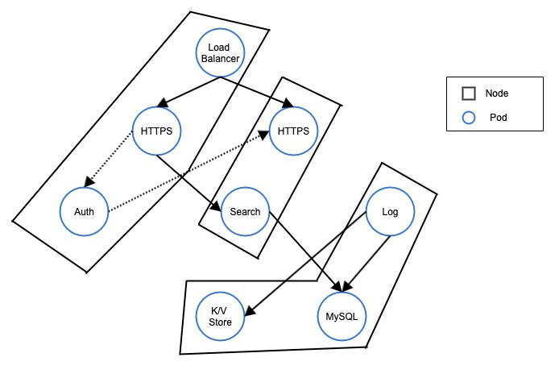
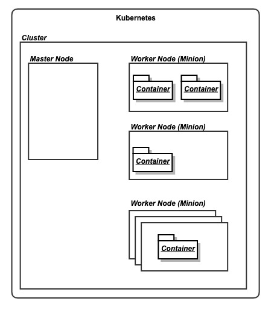
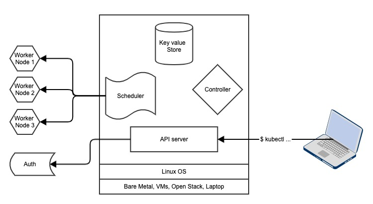
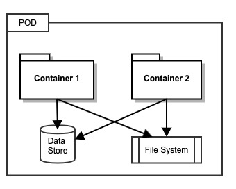
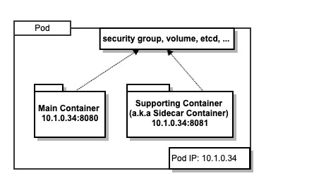
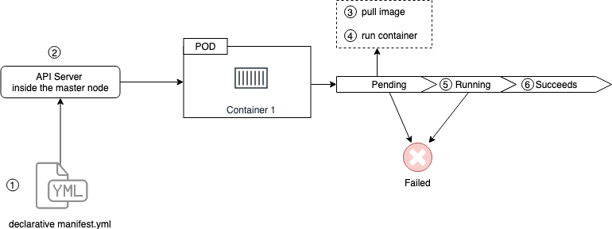
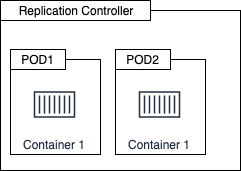
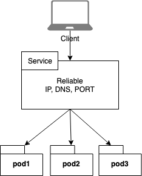
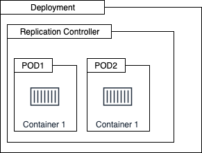

Title: The Insides of Kubernetes and how it actually works.
Date: 2019-9-06 14:30
Modified: 2019-9-06 14:30
Category: tutorial, blog, information
Cover: images/k8s/k8s.png
Tags: devops, kubernetes, container, orchestration
Slug: k8s-in-out
Summary: In this article, you'll learn about the REST objects in kubernetes (pods, replication controller, deployments, service)

> "It groups containers that make up an application into logical units for easy management and discovery. Kubernetes builds upon 15 years of experience of running production workloads at Google, combined with best-of-breed ideas and practices from the community." — Kubernetes, Production-Grade Container Orchestration

### What is Kubernetes?

In a typical micro service architecture using k8s, we have these things:

- In a simple term, k8s is composed of Nodes and Pods.
- Combination of nodes creates a cluster aka kubernetes cluster.
- You can consider nodes as a physical or virtual server.
- There are two kinds of nodes:
    1. Master node (Controls what's going on)
    2. Node aka Minions (That does the actual work)
- Each node has pods.
- Each pods have one or more container running inside it.

**In the birds eye view, Kubernetes architecture can be viewed as:**

### Nodes:
A node is a worker machine in Kubernetes. Learn more [here](https://lmgtfy.com/?q=kubernetes+nodes)

There are two types of nodes:

1. Master node
2. Worker node

#### Master Node
- There can be one or more master node in a k8s cluster.
- Best practice is to make master node free of workloads so that master node can only look after cluster.
- You can think master node as a shepherd who who tends and rears sheep. (worker nodes)

**What's inside a master node?**

- Remember a Node is a machine. So the base layer is the hardware layer. It can be bare metal, a virtual server, EC2 instance or even your personal laptop (if you are in local environment)
- Then the layer after that is OS layer. And remember, K8s only works in Linux OS. Kubernetes is platform agnostic in terms of hardware lever, but it needs Linux OS to operate.

**Components of Master node:**

1. Scheduler: 
Watches for new pods and assign work to that pod.

2. Controller:
This watches for changes in the cluster

3. Key Value Store:
This is the persistent storage service. It uses [etcd](https://etcd.io/) to maintain it's state. So in a master node, only this component is stateful.

4. API server: This exposes the REST API for developers and clients to interact with k8s cluster. Developers deal directly with api server via command line tool provided by kubernetes called `kubectl`. API server can also be linked with authentication service to provide extra layer of security for k8s cluster.

#### Worker Node

Worker node (also used to be called as minion) are also a machine that does the actual work. For example, updating a shopping cart or authenticating a user in your web application.

**What's inside a worker node?**

1. Kubelet:
They are main k8s agent
They instantiate pod, register node with a cluster and operate on port 10255
Kubelet just report back to master node if a container dies. 
The endpoint provied by kubelet are: `/spec`, `/healtz` , `/pods`

2. Container Engine:
They do container management (pulling image, running container)

3. Kube Proxy
Responsible for K8s networking
This makes sure that each pod get unique IP address for network communication
If more than 1 container is running inside a pod, then all pod share the same IP address but the port is different
This also does load balancing across all pods in a service (#service section)

### Declarative model and Desired state
Kubernetes work in declarative model. Which basically means that we provide the APIServer (which is inside the master node) some specification to describe the desired state. The specification is written in JSON or YAML format. 
Once we provide the specification **declaration**, then it's the responsibility of Kubernetes to maintain the *desired* state. 

#### Declarative Model
We give manifest to do something. For example: At each time, there must be 5 containers running.
#### Desired State
This is done by k8s internally. For example: Since we declared to run 5 replicas, but at a particular instant of time, if only 4 are running (which don't match with declaration), then k8s kicks in and tries to maintain the desired state from the declaration manifest (written in YAML or JSON which is provided to master node)

### Pods

- Pods are atomic unit of deployment in k8s world and they exists inside a node
- Containers always runs inside a pod
- Pods can have multiple containers (only in advanced cases, but ideally one)
- If two containers are running inside a same pod, then they share same memory space and volumes. This running more than one containers are useful if we want tightly coupled architecture.

Here in above figure, these two containers share the same DB and also same file system and also the same IP address. 

In detail:

Containers inside the pod share the same IP address of the pod, but the port of each container is different. Intra container communication happens inside the pods by localhost. 

For loosely coupled system, the containers from two different pods can talk to each other through network communication.

- Pods are also the unit of scaling in kubernetes world. We scale pods up and down (add or remove pods) while scaling.
- Pods are *atomic*. Which means we just create replicas of pods. We don't wait for the containers to be up before creating a pod. We just create create replicas of already up and running pods.
- Pod lifecycle is: 
    pending :arrow_right: running :arrow_right: success or failed :arrow_right: die
- There is no half (partially up) pod. Either it's up or not. 
- Ideally 1 pod gets scheduled to one node

Pod Lifecycle:

1. First we provide the manifest file to API server in k8s master node
2. API server receives manifest file and tries to run container and pod goes to pending mode
3. In pending mode, image is downloaded
4. Then container inside the pods are run
5. Then it goes to running mode
6. And if the purpose of pod is full filled, then when pod is gracefully stopped, it goes to succeed state

Note: If for some whatever reason, if some problem arises in pending mode, then the pod goes to failed mode.

### Replication Controller
But, in real world, we really don't work with pods directly. We use ReplicationController to work with pods.
ReplicationController sits on top of pod and it instantiating the pod(s)

### Services
- Pods are volatile. They are not persistent.
- Pods go alive and die rapidly. When they die and generate their IP address changes rapidly. If pods die or new pods are added it's very difficult to manage the IP address and connection between these pods. To address this issue, we make use of service. 
- Service sits between pods layer and manages the network connection between the pods
- They also do load balancing tasks
- It's the job of service to send traffic to healthy pods and it uses TCP protocol by default
- When our app is deployed in Kubernetes, we want it to be used by public. Hence, Service also helps to expose our application to public world (in the internet)
- Service gets single DNS, static IP, and never changing port. 
- Services are stateful and they never change once defined. 
- Services and pods are tied together by label
- Our client can talk to service in-order to get access to the application hosted in the pods

### Deployments

- These are the one which we interact the most
- They sit above the replication controller. And in the world of k8s deployment, replication sets are called replica set
- Deployments are:
  1. Self documenting
  2. Write spec once, deploy many
  3. Versioned
  4. Simple rolling updates and rollbacks
  5. Proper first class REST objects in k8s api
  6. Defined in standard manifest file
  7. Deployed via API server (in master node)
  8. Add features to replication controller
